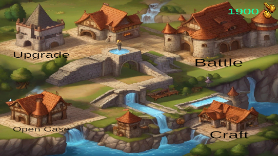
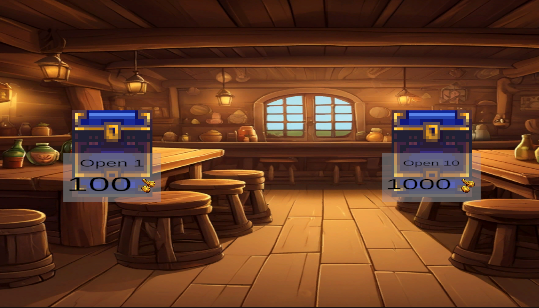
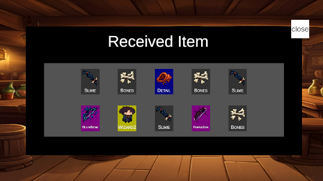
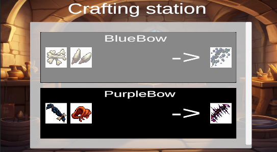
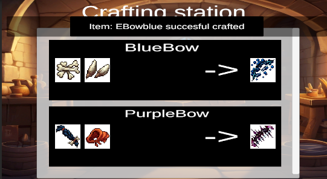
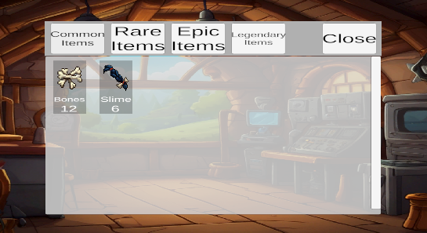
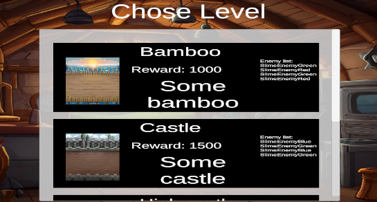
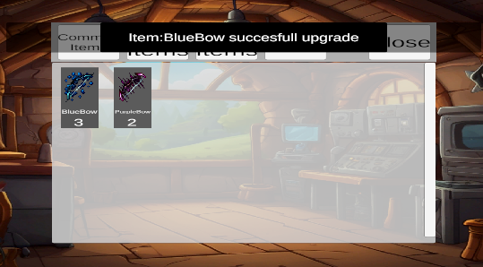
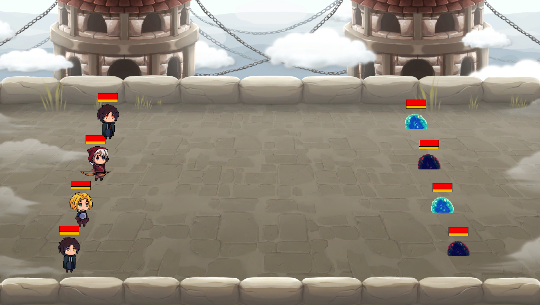

## Collective characters game

### About
____
A prototype game about collecting characters. Game has inventory, cases with random drops, crafting items, pumping heroes and arenas where they compete with each other 4 on 4 in auto battle.

### Developers
____

### Game Screnshots
____

  

  

  

  

